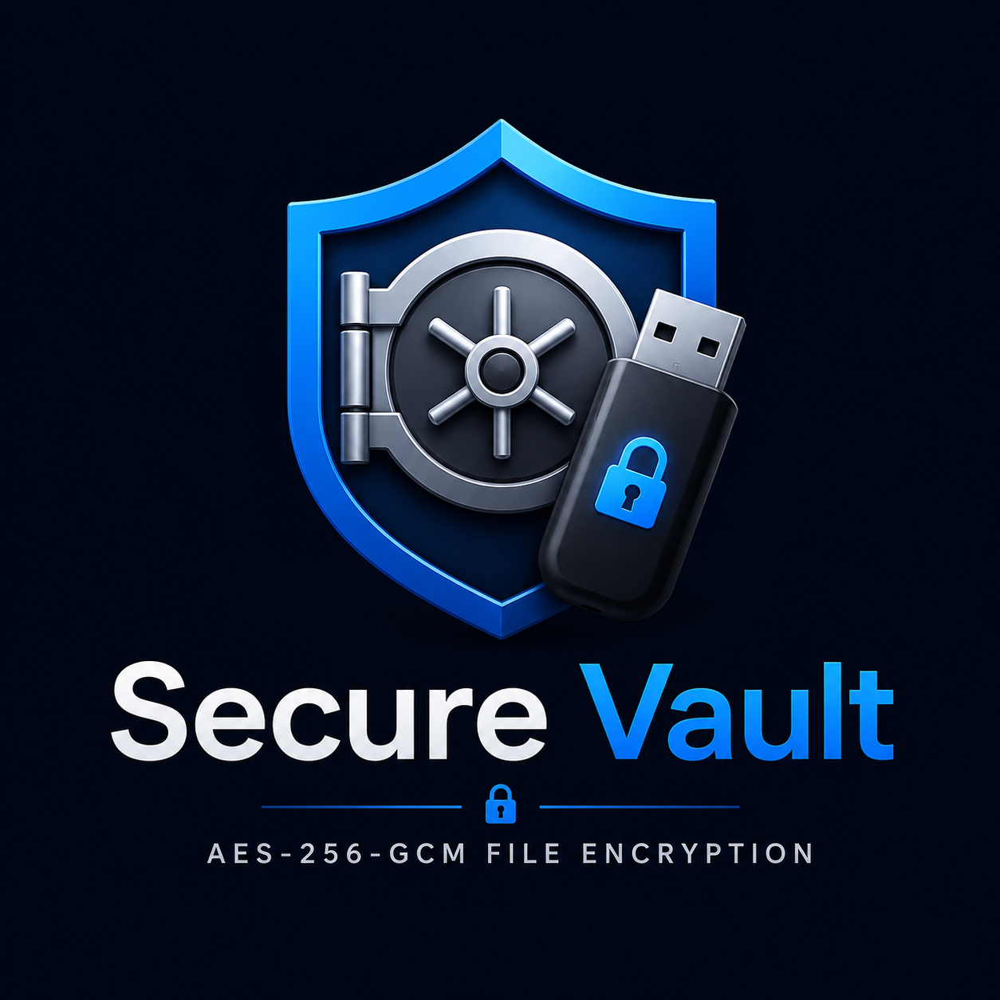

# Secure Vault

<p align="center">
  
</p>

<p align="center">
  <b>Local-first file encryption for Windows, secured by a physical USB key instead of a password.</b>
</p>

---

## Table of Contents

- [What this is](#what-this-is)
- [Why a USB key instead of a password](#why-a-usb-key-instead-of-a-password)
- [Features](#features)
- [Installation](#installation)
- [First-time setup](#first-time-setup)
- [Using Secure Vault](#using-secure-vault)
  - [Encrypting a file](#1-encrypt-a-file)
  - [Decrypting a file](#2-decrypt-a-file)
  - [Registering a USB key](#3-register-usb-key)
  - [Viewing registered devices](#4-view-registered-devices)
  - [Backups](#5-backups)
  - [Restoring a file](#6-restore)
  - [Email alerts (Option 7)](#7-email-alerts)
  - [Right-click integration](#8-right-click-integration)
- [Command-line usage](#command-line-usage)
- [Configuration files](#configuration-files)
- [Building the installer from source](#building-the-installer-from-source)
- [Security notes](#security-notes)
- [Troubleshooting](#troubleshooting)
- [License](#license)

---

## What this is

Secure Vault encrypts individual files (or folders) on your Windows machine using AES-256-GCM. Instead of protecting the encryption key with just a password, the key is generated randomly and stored on a **USB flash drive** you choose. To decrypt anything later, that same USB drive has to be physically plugged in.

## Why a USB key instead of a password

Passwords can be guessed, phished, keylogged, or brute-forced. A physical key can't be remotely stolen the way a password can. Trade-offs to understand before you rely on this:

- If someone steals your laptop but **not** your USB drive, they cannot decrypt your files.
- There is nothing to type, remember, or leak.
- **There is no password reset.** If you lose the USB drive and don't have a backup of the key file on it, anything encrypted with it is permanently unrecoverable. Treat that drive like a physical house key — know where it is at all times, and consider keeping a backup copy of the key file itself in a safe second location.

## Features

- AES-256-GCM encryption with scrypt key derivation
- USB-based master key, plus optional per-device keys for multiple machines
- Encrypted local backups with automatic rotation (keeps the last 5, expires after 30 days)
- File integrity checksums (detects tampering/corruption)
- Multi-pass secure delete of the original file after encryption
- Optional email alerts when vault actions happen
- Optional right-click "Encrypt/Decrypt with Secure Vault" entry in Windows Explorer
- Fully unattended installer — no interaction required beyond the initial double-click

---

## Installation

1. Go to the [Releases page](../../releases) and download the latest `SecureVaultSetup-x.x.x.exe`.
2. Run it.
   - **Windows may show a "Windows protected your PC" SmartScreen warning.** This is expected for a new, unsigned installer — click **"More info" → "Run anyway"**. See [Security notes](#security-notes) for why this happens.
   - The installer requires administrator rights (it may install Node.js if it's missing, and can register a right-click shell extension).
3. During setup you'll be asked whether to create a desktop shortcut and whether to add the right-click menu integration — both optional, check the boxes you want.
4. The installer will:
   - Check for Node.js and install it silently if missing
   - Install the app to `Program Files\SecureVault` (or your chosen location)
   - Install the one required dependency (`nodemailer`, used only for the optional email feature)
   - Create Start Menu / Desktop shortcuts
5. Click **Finish** — Secure Vault launches automatically.

No manual steps, no command line required for a normal install.

---

## First-time setup

The very first thing to do after installing is **register a USB drive as your master key**. Nothing can be encrypted or decrypted until this is done.

1. Plug in a USB flash drive you're comfortable dedicating to this purpose.
2. Launch Secure Vault (Start Menu or Desktop shortcut).
3. From the menu, choose **Option 3 — Register USB**.
4. Type: `master`
5. Enter the drive letter, e.g. `E:` (see [Troubleshooting](#troubleshooting) if this fails).
6. Secure Vault writes a `.vault_master.key` file to the root of that drive. **Do not delete this file, and do not lose this drive.**

Optional but recommended: copy that `.vault_master.key` file to a second, safely-stored USB drive as a backup, in case the primary one is ever lost or damaged.

---

## Using Secure Vault

Launch the app via the Start Menu / Desktop shortcut to get the interactive menu:

```
========================================
  SECURE VAULT
========================================
  1. Encrypt a file
  2. Decrypt a file
  3. Register USB
  4. View devices
  5. View backups
  6. Restore file
  7. Configure email
  8. Install right-click menu
  9. Exit
```

### 1. Encrypt a file
Choose option 1, then enter the full path to the file or folder. Your registered USB drive must be plugged in. The output is a `.vault` file; the original is securely deleted (overwritten 3 times) after a successful encryption and backup.

### 2. Decrypt a file
Choose option 2, enter the path to the `.vault` file. Your registered USB drive must be plugged in — decryption is impossible without it.

### 3. Register USB key
Covered in [First-time setup](#first-time-setup) above. You can also register **additional per-device keys** (choose `device` instead of `master`) if you want a separate key for a second machine while keeping one master key overall.

### 4. View registered devices
Lists every USB key (master and device) currently registered, pulled from `config/registered-devices.json`.

### 5. Backups
Every time you encrypt a file, Secure Vault automatically saves an encrypted backup copy locally (rotated — keeps the 5 most recent, auto-expires after 30 days). Option 5 lets you list and view these.

### 6. Restore
Restores a file from one of those local backups, in case you need the pre-encryption version back without going through decrypt.

### 7. Email alerts
Optional. Sends you an email whenever a vault action happens (encrypt/decrypt), including which file, which computer, and when.

**Setup requires a Gmail App Password — not your normal Gmail password.** Steps:

1. Make sure **2-Step Verification is enabled** on the Gmail account you want to send from — go to [myaccount.google.com/security](https://myaccount.google.com/security) and turn it on if it isn't already. App Passwords are unavailable without this.
2. Go to [myaccount.google.com/apppasswords](https://myaccount.google.com/apppasswords), sign in, and generate a new App Password (name it anything, e.g. "Secure Vault"). Copy the 16-character code shown — it's only displayed once.
3. In Secure Vault, choose **Option 7**.
4. Answer the prompts:
   - `Enable email alerts? (y/n)` → `y`
   - `Your Gmail address` → the account you generated the App Password for
   - `Gmail App Password` → paste the 16-character code (not your real Gmail password)
   - `Alert recipient email` → where you want alerts sent (can be the same address)

Notes:
- This feature is Gmail-only as currently built (hardcoded to `smtp.gmail.com`).
- The App Password is stored in plaintext in `config/settings.json` on your machine — don't share that file, and don't commit it with real credentials to a public repository.
- If sending fails (bad password, no internet), it logs an error and continues — it will never block or break an encrypt/decrypt operation.
- Fully optional — answering `n` skips it, and everything else works identically.

### 8. Right-click integration
Adds "Encrypt with Secure Vault" / "Decrypt with Secure Vault" to the Windows Explorer right-click menu, so you can encrypt/decrypt without opening the app menu first.

---

## Command-line usage

Everything is also available without the interactive menu:

```
node secure-vault-launcher.js encrypt "C:\path\to\file"
node secure-vault-launcher.js decrypt "C:\path\to\file.vault"
node secure-vault-launcher.js register master E:
node secure-vault-launcher.js register device F:
node secure-vault-launcher.js devices
node secure-vault-launcher.js backup list
node secure-vault-launcher.js backup view <name>
node secure-vault-launcher.js backup view-latest
node secure-vault-launcher.js restore list
node secure-vault-launcher.js restore restore "C:\path\to\file"
node secure-vault-launcher.js email
node secure-vault-launcher.js rightclick
node secure-vault-launcher.js help
```

Run this from the install folder (e.g. `C:\Program Files\SecureVault`).

---

## Configuration files

| File | Purpose |
|---|---|
| `config/settings.json` | Email alert settings (address, App Password, enabled flag) |
| `config/registered-devices.json` | List of registered USB devices |

These are created with safe placeholder values on install and update automatically as you use the app — no manual editing required.

---

## Building the installer from source

Requires [Inno Setup 6](https://jrsoftware.org/isinfo.php) if building locally on Windows:

```
iscc installer.iss
```

Output: `dist/SecureVaultSetup-<version>.exe`

**Or let GitHub Actions build it for you** (no Windows machine needed) — push a version tag:

```
git tag v3.2.0
git push origin v3.2.0
```

The workflow in `.github/workflows/build.yml` builds the installer on a Windows runner and automatically attaches it to a GitHub Release.

---

## Security notes

- The encryption key exists in plaintext only on your registered USB drive and briefly in memory during an encrypt/decrypt operation — it is never transmitted anywhere.
- Uses Node's built-in `crypto` module: AES-256-GCM with scrypt key derivation, random salts and IVs per operation, and authentication tags to detect tampering.
- **This project has not undergone an independent third-party security audit.** It's built on standard, well-reviewed cryptographic primitives, but the implementation itself has only been reviewed informally. Use it for what you'd be comfortable losing, not as your only line of defense for anything irreplaceable.
- Secure delete overwrites the original file 3 times before removing it — note that on SSDs, wear-leveling means overwrite-based deletion doesn't guarantee the original data is unrecoverable at the hardware level.
- The installer is currently unsigned, which is why Windows shows a SmartScreen warning on first run. Unsigned doesn't mean unsafe — it means Windows hasn't yet built reputation for this specific publisher/file. You can verify the source code yourself in this repository before trusting the compiled `.exe`.

---

## Troubleshooting

**"Enter drive" — what format should I use?**
Any of `E`, `e`, `E:`, or `E:\` work — Secure Vault normalizes it automatically and verifies the drive exists before writing anything.

**`ENOENT` error mentioning a folder like `e\.vault_master.key` inside your install directory**
This was a bug in older versions where a drive letter typed without a colon (e.g. just `e`) was misread as a relative folder name instead of a real drive. Fixed as of this version — update to the latest release if you still see this.

**Email alerts aren't sending**
- Confirm 2-Step Verification is on for the Gmail account.
- Confirm you used an **App Password**, not your regular Gmail password.
- Check your internet connection.
- The error message printed to the console will usually state the specific cause.

**SmartScreen blocks the installer**
Click "More info," then "Run anyway." This is expected for an unsigned installer — see [Security notes](#security-notes).

**Node.js / 7-Zip install seems to hang**
Check for a Windows UAC ("Do you want to allow this app to make changes?") prompt, possibly hidden behind other windows — the silent installers still require this one confirmation click.

---

## License

MIT — see [LICENSE](LICENSE).
